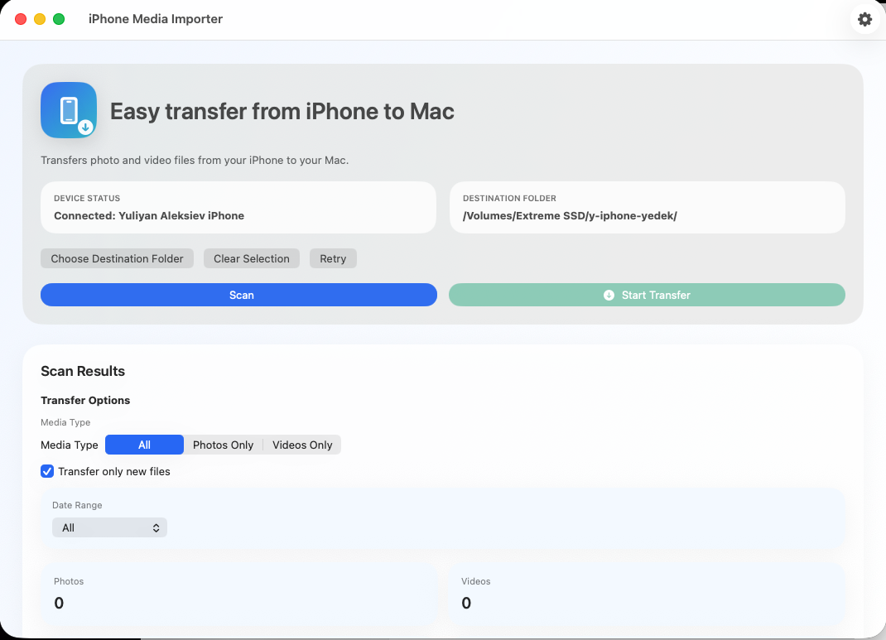
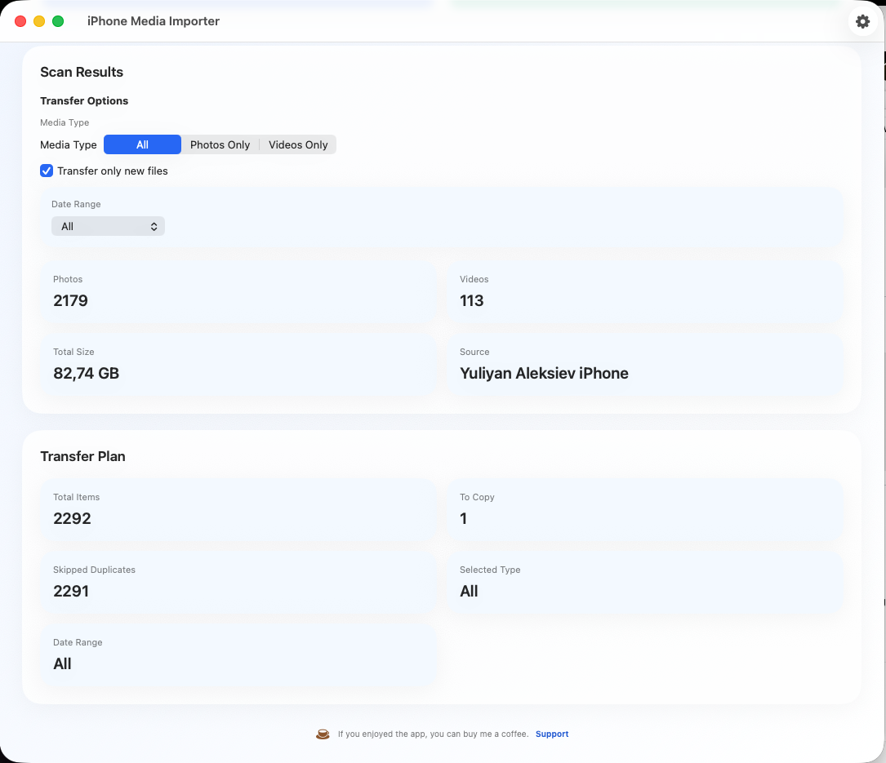
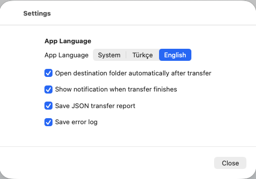

## Screenshots

### Main Screen


### Scan Results


### Transfer Complete


### Settings



# iPhone Media Importer
iPhone Media Importer is a lightweight macOS app that helps you transfer iPhone photos and videos to your Mac in a clean, organized, and reliable way.

iPhone Media Importer is a macOS desktop app for transferring photos and videos from an iPhone to a Mac in a clean and organized way.

It is designed to keep the workflow simple and reliable:
- Detects a connected iPhone over USB
- Scans only photo and video files
- Lets the user choose a destination folder
- Organizes imports by media type, year, and month
- Avoids duplicate copies
- Shows transfer progress, speed, and completion summary
- Supports Turkish and English UI

## Technology

- `Swift + SwiftUI`: modern, native, and maintainable for macOS
- `ImageCaptureCore`: official Apple framework for accessing iPhone media over USB
- `OSLog`: lightweight system-friendly logging
- `MVVM + service layer`: keeps UI, business logic, and device access separated

`SwiftUI` was chosen over a pure `AppKit` implementation because this app benefits more from fast iteration, clear state flow, and a modern macOS UI than from low-level window customization.

## Device Access Strategy

- Watches USB-connected devices with `ICDeviceBrowser`
- Works with `ICCameraDevice` instances recognized as iPhone-like Apple mobile devices
- Reads media via `mediaFiles`
- Downloads with `ICCameraFile.requestDownloadWithOptions`
- Stores the selected destination folder as a security-scoped bookmark

Important:
- The iPhone must be unlocked
- The user may need to confirm `Trust This Mac`
- Sandboxed distribution requires `com.apple.security.files.user-selected.read-write`

## Date and Folder Rules

Date priority:

1. `exifCreationDate`
2. `creationDate`
3. `fileCreationDate`
4. `modificationDate`
5. `fileModificationDate`
6. Import time

Example output structure:

```text
Fotograflar/2025/03_Mart
Videolar/2025/01_Ocak
```

## Features

- Detects an iPhone automatically
- Scans only photos and videos
- Lets the user select a destination folder
- Organizes imports by type, year, and month
- Prevents duplicate imports
- Supports media type and date filtering
- Supports pause, resume, and cancel
- Shows progress, transfer speed, and estimated remaining time
- Shows a transfer summary after completion
- Generates error logs and JSON transfer reports
- Includes a small support link in the UI footer

## Project Structure

```text
Sources/iPhoneMediaImporterApp/
  App/
  Models/
  Services/
  Utilities/
  ViewModels/
  Views/
```

## Running in Xcode

1. Open Xcode
2. Open `iPhoneMediaImporter.xcodeproj`
3. Select the `iPhoneMediaImporter` shared scheme
4. Run the app

For tests, use `Product > Test`.

Configuration files already included:
- `Config/Info.plist`
- `Config/AppSandbox.entitlements`
- `Config/Debug.xcconfig`
- `Config/Release.xcconfig`

If you want to use `xcodebuild` from the command line, make sure full Xcode is selected:

```text
sudo xcode-select -s /Applications/Xcode.app/Contents/Developer
```

## Demo Mode

To test the UI flow without a real iPhone, run with:

```text
IPHONE_IMPORTER_DEMO=1
```

This mode generates sample media items and simulates transfer progress.

There is also a ready-to-use shared scheme:
- `iPhoneMediaImporter Demo`

## Tests

The project includes unit tests for core business rules.

```text
swift test
```

If `swift test` fails on your machine, it is usually caused by local toolchain or SDK configuration rather than the app logic itself.

## Release and Distribution

There is a helper script for release builds:

```text
./Scripts/release_build.sh
```

Before using it:

1. Copy `Config/SigningOverrides.xcconfig.example` to `Config/SigningOverrides.xcconfig`
2. Set your own `DEVELOPMENT_TEAM`, `PRODUCT_BUNDLE_IDENTIFIER`, and signing identity
3. Create a notary profile:

```text
xcrun notarytool store-credentials "iPhoneMediaImporterNotary"
```

4. Run the script with your values:

```text
NOTARY_PROFILE=iPhoneMediaImporterNotary \
DEVELOPMENT_TEAM=TEAMID1234 \
PRODUCT_BUNDLE_IDENTIFIER=com.yourcompany.iPhoneMediaImporter \
./Scripts/release_build.sh
```

The script automates:
- release archive
- Developer ID export
- app zip creation
- notarization submission
- stapling
- final verification

For more detail, see [ReleaseGuide.md](/Users/yuliyanognyanov/Documents/iphoneBackup/Docs/ReleaseGuide.md).

## Notes

This project is currently shared as an unsigned macOS build unless it is manually signed and notarized.

macOS may show a security warning on first launch.
If needed, open the app using `Right Click > Open`.

## Official References

- [ImageCaptureCore](https://developer.apple.com/documentation/imagecapturecore)
- [ICDeviceBrowser](https://developer.apple.com/documentation/imagecapturecore/icdevicebrowser)
- [ICCameraDevice](https://developer.apple.com/documentation/imagecapturecore/iccameradevice)
- [ICCameraFile](https://developer.apple.com/documentation/imagecapturecore/iccamerafile)
- [Security-scoped bookmarks](https://developer.apple.com/documentation/foundation/nsurl/bookmarkdata(options:includingresourcevaluesforkeys:relativeto:))
